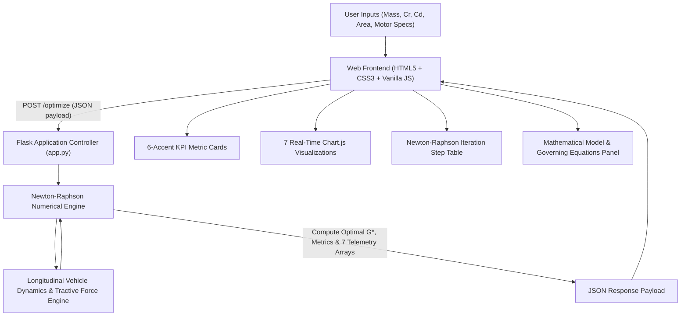

<div align="center">

# ⚡ EVOpt — Electric Vehicle Gear Ratio Optimizer

**An Engineering-Grade Web Platform for Powertrain Transmission Optimization Using the Newton-Raphson Numerical Method**

[](https://gare-ten.vercel.app/)
[](https://www.python.org/)
[](https://flask.palletsprojects.com/)
[](https://www.chartjs.org/)
[](https://gare-ten.vercel.app/)

<br/>

🌐 **[Try the Live Web App](https://gare-ten.vercel.app/)** • 📖 **[View Dataset](https://gare-ten.vercel.app/dataset)** • 🚀 **[GitHub Repo](https://github.com/Sanhith30/EVOpt-Gear-Ratio-Optimizer)**

<br/>

> **EVOpt** is an interactive, simulation-driven web application designed for EV powertrain engineers, researchers, and automotive evaluators. It optimizes the single-speed reduction gear ratio ($G$) of an electric vehicle by balancing tractive effort, acceleration time, maximum cruising speed, and gradeability using robust **Newton-Raphson root-finding algorithms**.

</div>

---

## 📑 Table of Contents

- [Overview](#-overview)
- [Live Demo](#-live-demo)
- [Key Features](#-key-features)
- [Mathematical Model & Governing Equations](#-mathematical-model--governing-equations)
- [System Architecture](#-system-architecture)
- [Interactive Visualizations & Telemetry](#-interactive-visualizations--telemetry)
- [UI/UX Design System](#-uiux-design-system)
- [Project Assumptions](#-project-assumptions)
- [Getting Started](#-getting-started)
  - [Prerequisites](#prerequisites)
  - [Local Installation](#local-installation)
  - [Generating Dataset](#generating-dataset)
  - [Running the Local Server](#running-the-local-server)
- [Vercel Deployment Guide](#-vercel-deployment-guide)
- [Project Directory Structure](#-project-directory-structure)
- [Author & Credits](#-author--credits)

---

## 🌟 Overview

The transmission gear reduction ratio ($G = N_{\text{motor}} / N_{\text{wheel}}$) in an electric vehicle represents one of the most fundamental powertrain design tradeoffs:

- **Higher Gear Ratio ($G \uparrow$):** Multiplies motor torque at the drive wheels ($T_w = T_m \cdot G \cdot \eta_{\text{trans}}$), delivering rapid initial acceleration ($0 \to 100\text{ km/h}$) and high road grade climbing capability, but constrains maximum speed due to motor redline RPM limits.
- **Lower Gear Ratio ($G \downarrow$):** Unlocks higher top speeds and reduces motor cruising RPM (lowering copper and iron core thermal losses), but compromises off-the-line tractive torque and hill climbing.

**EVOpt** bridges this multi-objective tradeoff by computing the mathematically optimal reduction ratio $G^*$ that minimizes a composite objective function using the **Newton-Raphson numerical optimization solver**.

---

## 🚀 Live Demo

The production application is live and hosted on Vercel:

👉 **[https://gare-ten.vercel.app](https://gare-ten.vercel.app/)**

- **Optimization Dashboard:** Test any combination of vehicle mass, rolling resistance, aerodynamic drag, and motor specs.
- **Interactive Graphs:** Dynamic Chart.js visualizations that update instantly.
- **Dataset Inspector:** Browse and download the 1,000-point operating dataset directly via CSV.

---

## ⚡ Key Features

- **🎯 Newton-Raphson Numerical Optimization Engine:**
  - Iterative root-finding algorithm: $G_{k+1} = G_k - \frac{f(G_k)}{f'(G_k)}$
  - Convergence tolerance ($\epsilon < 10^{-5}$) with detailed iteration log (step, current $G$, residual error, convergence status).
- **🏎️ 1-Click Real-World EV Presets:**
  - Instant one-click configuration switcher loading verified OEM vehicle specifications:
    - **Tesla Model 3 / Y** (Mass: 1,840 kg, Torque: 450 N·m, $C_d$: 0.23)
    - **Porsche Taycan** (Mass: 2,295 kg, Torque: 650 N·m, $C_d$: 0.22)
    - **Tata Nexon EV** (Mass: 1,400 kg, Torque: 215 N·m, $C_d$: 0.32)
    - **Smart EQ City EV** (Mass: 1,080 kg, Torque: 160 N·m, $C_d$: 0.35)
    - **Custom Configuration**
- **⚙️ Single-Speed vs. 2-Speed Dual-Gear Transmission Comparison:**
  - Simulates high-performance 2-speed EV gearbox dynamics (similar to Porsche Taycan architecture):
    - **Gear 1 (Launch & Climb):** High reduction ratio optimizing $0 \to 100\text{ km/h}$ acceleration and 35%+ gradeability.
    - **Gear 2 (High-Speed Cruise):** Taller ratio reducing highway motor RPM and iron core thermal losses.
    - **Shift Speed Threshold:** Automatically calculated shift transition point.
- **🔋 Real-World Drive Cycle & Battery Range Estimator:**
  - Evaluates energy consumption ($\text{kWh / 100 km}$) and estimated range across international driving cycles:
    - **WLTP Combined Cycle** (46.5 km/h avg speed)
    - **Urban / City Stop-and-Go** (28.0 km/h avg speed)
    - **Highway Cruising Cycle** (110.0 km/h avg speed)
  - Interactive battery pack selector: **40 kWh, 60 kWh (default), 75 kWh, and 100 kWh**.
- **🎛️ Dual-Input Sensitivity Range Sliders:**
  - Real-time synchronized range sliders and numeric input fields for vehicle mass, motor torque, speed, road grade, and aerodynamic drag.
- **🌓 Dark Mode / Light Mode Quick Toggle:**
  - Instant theme switcher (☀️ Light / 🌙 Dark) in the navigation header with persistent `localStorage` and dynamic Chart.js theme adaptation.
- **📄 1-Click PDF Engineering Report Export:**
  - Professional SAE/IEEE technical paper printable layout with executive summary, input table, 2-speed comparison, optimal $G^*$ results, and convergence logs via `window.print()`.
- **📊 7 Interactive Real-Time Diagnostic Charts:**
  - Acceleration vs. Gear Ratio, Max Speed, Gradeability, Power Losses, Transmission Efficiency, Composite Score, and Newton-Raphson error convergence decay.
- **⚙️ Governing Equations & Mathematical Model Panel:**
  - Placed directly below the optimization results so evaluators can inspect every governing formula in real-time.
- **💾 1,000-Point Synthetic Driving Cycle Dataset:**
  - Realistic multi-condition simulation with full CSV export functionality.

---

## 📐 Mathematical Model & Governing Equations

### 1. Vehicle Longitudinal Dynamics
At any road velocity $v$ (in $\text{m/s}$), the total opposing resistive force $F_{\text{resist}}$ acting on the vehicle is:

$$F_{\text{resist}} = F_{\text{rr}} + F_{\text{aero}} + F_{\text{grade}}$$

Where:
- **Rolling Resistance Force:**  
  $$F_{\text{rr}} = m \cdot g \cdot C_r \cdot \cos(\theta)$$
- **Aerodynamic Drag Force:**  
  $$F_{\text{aero}} = \frac{1}{2} \cdot \rho \cdot C_d \cdot A \cdot v^2$$
- **Gravitational Road Gradient Force:**  
  $$F_{\text{grade}} = m \cdot g \cdot \sin(\theta)$$

| Symbol | Parameter Description | Default Value | Unit |
|---|---|---|---|
| $m$ | Vehicle Gross Mass | $1,500$ | $\text{kg}$ |
| $g$ | Gravitational Acceleration | $9.81$ | $\text{m/s}^2$ |
| $C_r$ | Rolling Resistance Coefficient | $0.015$ | — |
| $\rho$ | Ambient Air Density | $1.225$ | $\text{kg/m}^3$ |
| $C_d$ | Aerodynamic Drag Coefficient | $0.28$ | — |
| $A$ | Frontal Projected Area | $2.20$ | $\text{m}^2$ |
| $\theta$ | Road Incline Angle | $\arctan(\text{Grade} / 100)$ | $\text{rad}$ |

---

### 2. Tractive Effort & Powertrain Kinematics
The net tractive force delivered by the electric motor through the transmission gearbox to the tire contact patch is:

$$F_t = \frac{T_m \cdot G \cdot \eta_{\text{trans}}}{r_w}$$

And the motor rotational velocity relates to vehicle speed $v$:

$$\omega_{\text{wheel}} = \frac{v}{r_w} \quad \implies \quad N_{\text{motor}} = \frac{60 \cdot v \cdot G}{2 \pi \cdot r_w}$$

Where:
- $T_m$: Motor Shaft Torque ($\text{N}\cdot\text{m}$)
- $G$: Transmission Reduction Ratio ($N_{\text{motor}} / N_{\text{wheel}}$)
- $\eta_{\text{trans}}$: Driveline Mechanical Efficiency ($\approx 95\%$)
- $r_w$: Dynamic Loaded Tire Radius ($\approx 0.31\text{ m}$)

---

### 3. Newton-Raphson Optimization Solver
The objective function balances three critical vehicle performance metrics:
1. **Acceleration Performance ($0 \to 100\text{ km/h}$)** (Weight: 40%)
2. **Top Speed Capability ($v_{\max}$)** (Weight: 40%)
3. **Maximum Gradeability ($\alpha_{\max}$)** (Weight: 20%)

The algorithm computes the root of the derivative of the composite cost function $f(G) = J'(G) = 0$:

$$G_{k+1} = G_k - \frac{f(G_k)}{f'(G_k)}$$

The solver terminates when the convergence criterion is met:

$$|G_{k+1} - G_k| < 10^{-5} \quad \text{or} \quad k \ge 20$$

---

## 🏗️ System Architecture



---

## 📊 Interactive Visualizations & Telemetry

| Chart | Metric Analyzed | Engineering Significance |
|---|---|---|
| **1. Acceleration vs. Gear Ratio** | $0 \to 100\text{ km/h}$ time (s) | Identifies the optimal torque multiplication point before tire traction limits |
| **2. Maximum Speed vs. Gear Ratio** | Top Speed ($\text{km/h}$) | Visualizes redline motor RPM cutoff constraint |
| **3. Gradeability vs. Gear Ratio** | Max Incline Grade ($\%$) | Demonstrates hill-climbing capacity under low-speed high-torque conditions |
| **4. Power Loss Breakdown** | Copper, Core, and Mechanical Losses ($\text{kW}$) | Quantifies thermal dissipation and powertrain energy efficiency |
| **5. Driveline Efficiency Curve** | System Efficiency ($\%$) vs. Vehicle Speed | Evaluates gearbox mechanical and electrical performance across speed ranges |
| **6. Multi-Objective Performance Score** | Composite Utility Index ($0 \to 100$) | Clearly highlights the global maximum at the optimal ratio $G^*$ |
| **7. Newton-Raphson Convergence Decay** | Residual Error $\log_{10}(\|G_{k+1} - G_k\|)$ | Proves rapid quadratic convergence of the numerical solver |

---

## 🎨 UI/UX Design System

EVOpt uses a curated light-theme design system:

- **Typography Palette:**
  - **Headings:** `DM Serif Display` — distinctive academic serif for mathematical authority
  - **Body & Controls:** `Plus Jakarta Sans` — ultra-legible, modern sans-serif
  - **Telemetry & Numbers:** `JetBrains Mono` — fixed-width tabular font for numerical values
- **Color Coding System:**
  - 🔵 **Indigo** (`#4f46e5`): Primary Controls & Mathematical Symbols
  - 🟣 **Violet** (`#7c3aed`): Brand Accent & Navigation
  - 🟢 **Emerald** (`#059669`): Optimal Gear Ratio & High Efficiency
  - 🟠 **Amber** (`#d97706`): Energy Consumption & Thermal Dissipation
  - 🔴 **Rose** (`#e11d48`): Acceleration Dynamics & Tractive Limits
  - 🩵 **Sky** (`#0284c7`): Aerodynamic Forces & Speed Telemetry
- **Micro-Interactions:** Smooth CSS hover transitions, glowing input focus rings, animated loading spinner, and responsive grid reflow.

---

## 📋 Project Assumptions

1. **Air Density ($\rho$):** $1.225\text{ kg/m}^3$ (standard sea-level atmospheric conditions at $15^\circ\text{C}$).
2. **Motor Redline RPM:** $8,000\text{ RPM}$ baseline ceiling.
3. **Optimization Weights:** Multi-objective composite score is weighted **40% Acceleration**, **40% Top Speed**, and **20% Gradeability**.
4. **Gear Ratio Definition:** Consistently implemented as motor rotational speed divided by wheel rotational speed ($G = N_m / N_w$). A higher reduction ratio increases wheel torque via $T_w = T_m \cdot G \cdot \eta_{\text{trans}}$.

---

## ⚡ Getting Started

### Prerequisites
- **Python 3.10** or higher
- **Git**

### Local Installation

1. **Clone the repository:**
   ```bash
   git clone https://github.com/Sanhith30/EVOpt-Gear-Ratio-Optimizer.git
   cd EVOpt-Gear-Ratio-Optimizer
   ```

2. **Create and activate a virtual environment:**
   - **Windows:**
     ```powershell
     python -m venv .venv
     .venv\Scripts\activate
     ```
   - **macOS / Linux:**
     ```bash
     python3 -m venv .venv
     source .venv/bin/activate
     ```

3. **Install dependencies:**
   ```bash
   pip install -r requirements.txt
   ```

### Generating Dataset

To regenerate the 1,000-point operating cycle dataset:
```bash
python generate_dataset.py
```
*Outputs `ev_operating_dataset.csv` containing speed, torque, electrical power demand, and gradient data.*

### Running the Local Server

Start the local Flask development server:
```bash
python app.py
```

Open your browser at:
```
http://127.0.0.1:5000
```

---

## 🌐 Vercel Deployment Guide

EVOpt is preconfigured for zero-configuration serverless deployment on Vercel:

1. Push your repository to GitHub.
2. Go to **[vercel.com/new](https://vercel.com/new)** and import `EVOpt-Gear-Ratio-Optimizer`.
3. Set Framework Preset to **Other**.
4. Click **Deploy**. Vercel will automatically configure the Python serverless function via `vercel.json`.

---

## 📁 Project Directory Structure

```text
EVOpt-Gear-Ratio-Optimizer/
├── app.py                     # Flask backend & Newton-Raphson solver
├── generate_dataset.py        # Driving cycle simulation dataset generator
├── ev_operating_dataset.csv   # 1,000-row pre-generated operating dataset
├── requirements.txt           # Minimal production dependencies (Flask>=3.0)
├── vercel.json                # Vercel serverless function routing configuration
├── .gitignore                 # Excluded environments, caches, and system files
├── README.md                  # Comprehensive project engineering documentation
├── templates/
│   ├── index.html             # Optimization dashboard with splash screen & math panel
│   └── dataset.html           # Operating dataset inspector & CSV downloader
└── static/
    ├── css/
    │   └── style.css          # Glassmorphism light theme design system
    └── js/
        └── app.js             # Form handling, AJAX API caller, & Chart.js rendering
```

---

## 👤 Author & Credits

- **Author:** [Sanhith30](https://github.com/Sanhith30)
- **Project:** EV Powertrain Gear Ratio Optimization using Newton-Raphson Numerical Method
- **Live Deployment:** [https://gare-ten.vercel.app](https://gare-ten.vercel.app/)
- **License:** Open-source for academic, research, and evaluation purposes.
